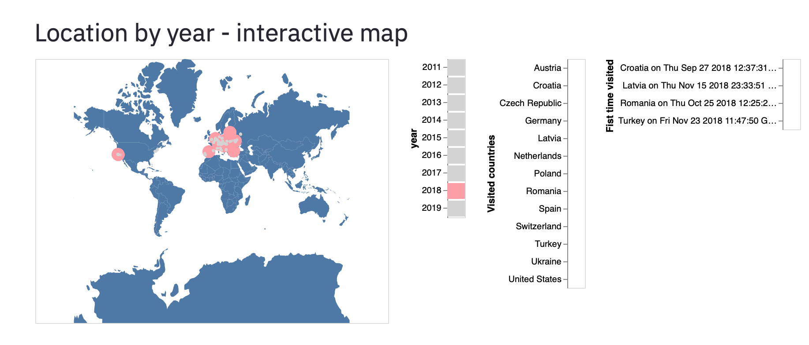
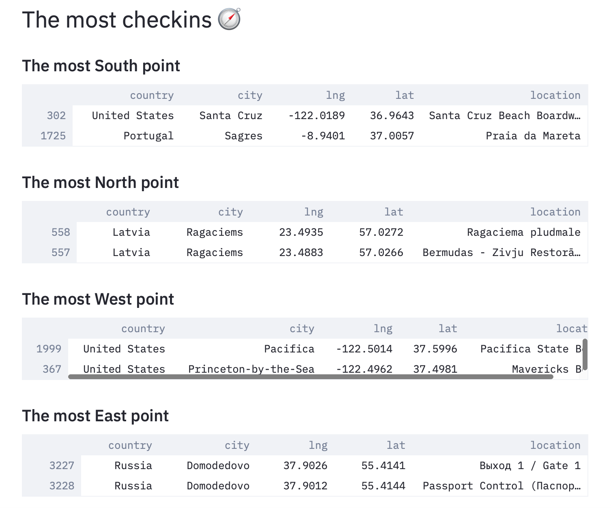

# Places traveled

It's hard to reach your goals if you do not have any.
On the other hand, it's certainly nice to leave some space for serenity, but it might also mean that you do not really make constant progress.

The idea of this project is to have a set of scripts that allow revisiting visually traveled destinations. As the primary matter of keeping track of these, I used Foursquare/Swarm.

## Demo

<p align="center"></p>

<p align="center"></p>

## Installation

Export Foursquare token via env variable. The Foursquare token and API can be explored at [link](https://foursquare.com/developers/explore#req=users%2Fself)

```sh
export FOURSQUARE=YOUR_TOKEN_HERE
```

Or if executed from within the shell like Google Colab or running Jupyter

```
%env FOURSQUARE=YOUR_TOKEN_HERE
```

## Running with [Streamlit](https://streamlit.io/s)

```sh
streamlit run streamlit/main.py
```

---
> GitHub [@lc0](https://github.com/lc0) &nbsp;&middot;&nbsp;
> Twitter [@lc0d3r](https://twitter.com/lc0d3r) &nbsp;&middot;&nbsp;
<!-- > [Code and Gradients](https://codeand.gradients.ml/) -->